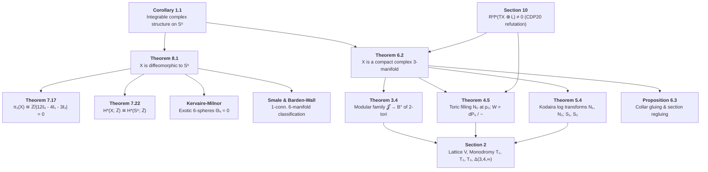

# Formalization of the Hopf Problem in Lean 4

This repository contains a machine-checked specification and formalization framework in **Lean 4 / Mathlib** for the complex structure on the 6-sphere $S^6$ presented in:

> **The $(3, 4, \infty)$ modular family of $2$-tori, completed at its three special points, is a complex structure on $S^6$** (2026)  
> *Subject*: Complex Algebraic Geometry, Modular Forms, Toric Degenerations, and the Hopf Problem (1953)

---

## 🏛️ Project Architecture

```
hopf-problem/
├── HopfProblem/                 # Standalone Lean 4 package (Lake + Mathlib)
│   ├── lakefile.toml            # Lake package config tracking leanprover/lean4:v4.33.1
│   ├── lean-toolchain           # Toolchain pinning
│   └── HopfProblem/             # Formal Lean 4 source modules
├── paper/
│   └── s6.pdf                   # Source paper (108 pages)
├── spec/                        # Libspec Declarative Specification Tree
│   ├── __init__.py              # Exported TPS proof guards & archetypes
│   ├── err.py                   # Context mixins & defensive programming guards
│   ├── hazards.py               # 17 domain & proof soundness hazards
│   ├── proof.py                 # ProofSoundnessGuard & 9 guarded proof archetypes
│   ├── toyota_strategy.py       # Toyota Production System (TPS) quality pillars
│   ├── lean_project.py          # Lake toolchain, Mathlib sync, and zero-sorry contracts
│   ├── infoview_util.py         # Persistent Lean LSP daemon & InfoView tooling contracts
│   ├── lattice_monodromy.py     # §2: Rank-4 lattice V, dual Λ, T₁, T₂, T₀, Q₀, Δ(3,4,∞)
│   ├── period_family.py         # §3: Periods τ, μ, β, period matrix Π(z), indefinite Hodge (1, 1)
│   ├── toric_filling.py         # §4: Mumford toric degeneration N₀, A₂ fan, dP₆ normalisation
│   ├── logarithmic_transforms.py# §5: Kodaira log transforms N₁, N₂, bielliptic surfaces S₁, S₂
│   ├── manifold_gluing.py       # §6: Holomorphic collar gluing, section translations (ℓ₀, ℓ₁, ℓ₂)
│   ├── topology_homology.py     # §7: π₁(X) ≅ ℤ/|12ℓ₀ - 4ℓ₁ - 3ℓ₂| = 0, Mayer-Vietoris, H*(X) ≅ H*(S⁶)
│   ├── sphere_recognition.py    # §8: Homotopy 6-sphere, Θ₆ = 0, Smale h-cobordism, X ≅_diff S⁶
│   ├── analytic_invariants.py   # §9: a(X) = 1, R^q f_* 𝒪_X, non-torsion K_X, Frölicher non-degeneration
│   ├── cdp_divergence.py        # §10: Refutation of CDP20, non-normality of W, R² f_*(TX ⊗ L) ≠ 0
│   └── main_spec.py             # Master Spec declaring topological module sequence
├── util/                        # Fast In-Memory InfoView & LSP Interactive Environment
│   ├── infoview                 # CLI client (< 30ms roundtrip) for live goal queries & `try` tactics
│   ├── lean_daemon.py           # Persistent background daemon managing `lake serve`
│   └── lean_infoview.py         # JSON-RPC 2.0 LSP client & interactive proving REPL
├── Makefile                     # Build, test, cache, and spec automation
└── pyproject.toml               # Python workspace configuration with libspec
```

---

## 🧭 Mathematical Dependency Graph



---

## 🚀 Quick Start

### 1. Inspect the Specification
```bash
# List all 74 specification components
make spec-list

# Inspect a specific component contract
uv run libspec show spec.sphere_recognition.IntegrableComplexStructureOnS6Req
```

### 2. Fast Interactive Proving via InfoView (< 30ms)
```bash
# Query tactic proof state at line/col
util/infoview HopfProblem/HopfProblem/Basic.lean 6 3

# Test candidate tactic in-memory without touching disk
util/infoview try HopfProblem/HopfProblem/Basic.lean 6 "omega"

# Inspect compiler diagnostics
util/infoview diags HopfProblem/HopfProblem/Basic.lean
```

### 3. Build & Verify
```bash
# Full batch build
make build

# Audit for unproven sorry/admit statements
make check-sorry
```
