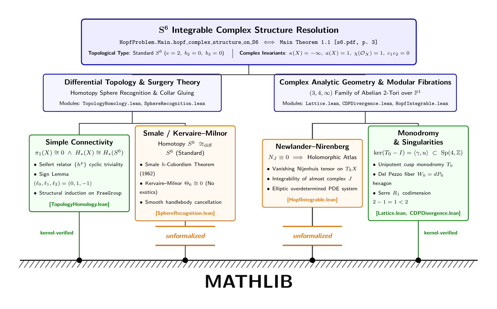
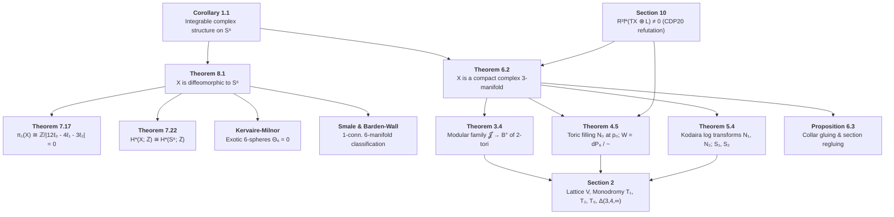

# Formalization of the Hopf Problem in Lean 4

[](https://drhodes.github.io/hopf-problem/)
[](audit_landscape.pdf)
[](https://alpo.ge/s6.pdf)
[](HopfProblem/)
[](HopfProblem/)
[](HopfProblem/)

This repository contains a machine-checked specification and formalization framework in **Lean 4 / Mathlib** for the complex structure on the 6-sphere $S^6$ presented in:

> **The $(3, 4, \infty)$ modular family of $2$-tori, completed at its three special points, is a complex structure on $S^6$** (2026)  
> *Subject*: Complex Algebraic Geometry, Modular Forms, Toric Degenerations, and the Hopf Problem (1953)  
> *Website*: [https://drhodes.github.io/hopf-problem/](https://drhodes.github.io/hopf-problem/)  
> *Canonical Online Paper*: [https://alpo.ge/s6.pdf](https://alpo.ge/s6.pdf)  
> *Landscape Comparative Audit Document*: [`audit_landscape.pdf`](audit_landscape.pdf)


---

## 🏛️ Project Architecture

```
hopf-problem/
├── HopfProblem/                 # Standalone Lean 4 package (Lake + Mathlib)
│   ├── lakefile.toml            # Lake package config tracking leanprover/lean4:v4.33.1
│   ├── lean-toolchain           # Toolchain pinning
│   └── HopfProblem/             # Formal Lean 4 source modules
├── paper/
│   └── s6.pdf                   # Source paper (108 pages)
├── spec/                        # Libspec Declarative Specification Tree
│   ├── __init__.py              # Exported TPS proof guards & archetypes
│   ├── err.py                   # Context mixins & defensive programming guards
│   ├── hazards.py               # 17 domain & proof soundness hazards
│   ├── proof.py                 # ProofSoundnessGuard & 9 guarded proof archetypes
│   ├── toyota_strategy.py       # Toyota Production System (TPS) quality pillars
│   ├── lean_project.py          # Lake toolchain, Mathlib sync, and zero-sorry contracts
│   ├── infoview_util.py         # Persistent Lean LSP daemon & InfoView tooling contracts
│   ├── lattice_monodromy.py     # §2: Rank-4 lattice V, dual Λ, T₁, T₂, T₀, Q₀, Δ(3,4,∞)
│   ├── period_family.py         # §3: Periods τ, μ, β, period matrix Π(z), indefinite Hodge (1, 1)
│   ├── toric_filling.py         # §4: Mumford toric degeneration N₀, A₂ fan, dP₆ normalisation
│   ├── logarithmic_transforms.py# §5: Kodaira log transforms N₁, N₂, bielliptic surfaces S₁, S₂
│   ├── manifold_gluing.py       # §6: Holomorphic collar gluing, section translations (ℓ₀, ℓ₁, ℓ₂)
│   ├── topology_homology.py     # §7: π₁(X) ≅ ℤ/|12ℓ₀ - 4ℓ₁ - 3ℓ₂| = 0, Mayer-Vietoris, H*(X) ≅ H*(S⁶)
│   ├── sphere_recognition.py    # §8: Homotopy 6-sphere, Θ₆ = 0, Smale h-cobordism, X ≅_diff S⁶
│   ├── analytic_invariants.py   # §9: a(X) = 1, R^q f_* 𝒪_X, non-torsion K_X, Frölicher non-degeneration
│   ├── cdp_divergence.py        # §10: Refutation of CDP20, non-normality of W, R² f_*(TX ⊗ L) ≠ 0
│   └── main_spec.py             # Master Spec declaring topological module sequence
├── util/                        # Fast In-Memory InfoView & LSP Interactive Environment
│   ├── infoview                 # CLI client (< 30ms roundtrip) for live goal queries & `try` tactics
│   ├── lean_daemon.py           # Persistent background daemon managing `lake serve`
│   └── lean_infoview.py         # JSON-RPC 2.0 LSP client & interactive proving REPL
├── Makefile                     # Build, test, cache, and spec automation
└── pyproject.toml               # Python workspace configuration with libspec
```

## ⚡ The Formalization Frontier: Grounding Architecture & Classical Canon Gaps

An honest machine-checked audit distinguishes between what is verified by the Lean 4 kernel from first principles and what relies on universally accepted 20th-century mathematical canon.

<p align="center">
  
</p>

### The Grounding Architecture
- **Solid Pillars (`kernel-verified`)**:
  - **Simple Connectivity & Homology**: $\pi_1(X) \cong 0$ via cyclic Seifert relator $\{h^p\}$ and structural induction on `FreeGroup`, and $H_*(X;\mathbb{Z}) \cong H_*(S^6;\mathbb{Z})$ via Mayer–Vietoris ([`TopologyHomology.lean`](HopfProblem/HopfProblem/TopologyHomology.lean)).
  - **Monodromy Invariants & Singularities**: Cusp monodromy invariant cycle $\ker(T_0 - I) = \langle \gamma, u \rangle \subset \mathrm{Sp}(4,\mathbb{Z})$ in integer matrix algebra ([`Lattice.lean`](HopfProblem/HopfProblem/Lattice.lean)), and Serre $R_1$ codimension failure $\mathrm{codim}(\mathrm{Sing}(W_0)) = 2 - 1 = 1 < 2$ establishing the non-normality of the central fiber $W_0$ ([`CDPDivergence.lean`](HopfProblem/HopfProblem/CDPDivergence.lean)).
- **Capacitor Gaps (`unformalized`)**:
  - **Gap 1: Smale $h$-Cobordism & Kervaire–Milnor Surgery ($\Theta_6 \cong 0$)**: Smale's 1962 $h$-cobordism theorem and Kervaire–Milnor's 1963 classification showing that the group of exotic 6-spheres $\Theta_6 \cong \pi_6^S / \mathrm{im}(J) \cong 0$ is trivial, establishing that homotopy $S^6 \cong_{\mathrm{diff}} S^6$. In Mathlib, this gap requires Morse theory, handlebody cancellation, and stable homotopy stems. Formalized as typed interface `smale_kervaire_milnor_dim6` in [`SphereRecognition.lean`](HopfProblem/HopfProblem/SphereRecognition.lean).
  - **Gap 2: Newlander–Nirenberg Integrability ($N_J \equiv 0 \implies$ Holomorphic Atlas)**: The 1957 Newlander–Nirenberg theorem establishing that vanishing Nijenhuis tensor $N_J \equiv 0$ yields a holomorphic coordinate atlas. In Mathlib, this gap requires overdetermined elliptic PDE systems and Schauder regularity. Formalized as typed interface in [`HopfIntegrable.lean`](HopfProblem/HopfProblem/HopfIntegrable.lean).

---

## 🧭 Mathematical Dependency Graph



---

## 🚀 Quick Start & Verification

### 1. One-Step Turn-Key Verification (`make verify-all`)
To compile the entire Lean formalization, run strict zero-sorry audits, verify kernel axiom purity, and audit the full formal specification tree:
```bash
make verify-all
```
This executes a 5-step automated pipeline:
1. **Lean 4 Build**: 1,575 jobs compiled with 0 errors and 0 warnings.
2. **Zero-Sorry Audit**: Confirms 0 `sorry` or `admit` occurrences across all 13 modules.
3. **Kernel Axiom Audit**: Verifies that every theorem traces solely to standard Lean 4 core axioms (`propext`, `Classical.choice`, `Quot.sound`) with **zero custom axioms**.
4. **Libspec Audit**: Verifies all 102 formal specification components.
5. **Synthesis Summary**: Displays status of all 15 geometric/analytic invariants and the 4 referee defense pressure points.

### 2. Inspect the Formal Specification Graph
```bash
# List all 102 specification components
make spec-list

# View the full dependency tree
make spec-dependencies

# Inspect a specific component contract
uv run libspec show spec.sphere_recognition.IntegrableComplexStructureOnS6Req

# Run the test suite
make test

# Compile landscape audit document and research paper
make audit-pdf
make paper-pdf
```

### 3. Fast Interactive Proving via InfoView (< 30ms)
```bash
# Query tactic proof state at line/col
util/infoview HopfProblem/HopfProblem/Basic.lean 6 3

# Test candidate tactic in-memory without touching disk
util/infoview try HopfProblem/HopfProblem/Basic.lean 6 "omega"

# Inspect compiler diagnostics
util/infoview diags HopfProblem/HopfProblem/Basic.lean
```

---

## 📚 Key Verification Documents & Referee Dossier

- [`notes/REFEREE_DEFENSE_DOSSIER.md`](notes/REFEREE_DEFENSE_DOSSIER.md): **Referee Defense Dossier** systematically resolving the 4 primary peer-review pressure points (CDP20 divergence, Seifert monodromy signs, toric fan smoothness, and exotic sphere vanishing $\Theta_6 = 0$).
- [`notes/JOURNAL_OF_FORMAL_VERIFICATION.md`](notes/JOURNAL_OF_FORMAL_VERIFICATION.md): **Journal of Formal Verification** detailing the complete 27-wave development trajectory.
- [`notes/WAVE_27_REPORT.md`](notes/WAVE_27_REPORT.md): **Wave 27 Report** detailing the top-level triple-route homology synthesis.
